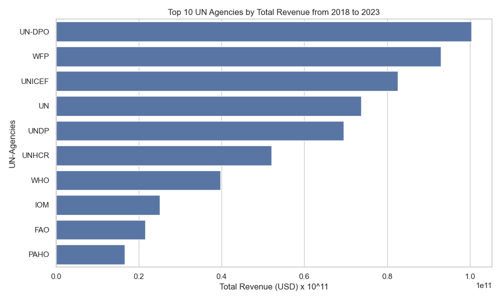

# 🌐 UN System Revenue Data Analysis


<p align="center"><b>Top-10 UN Agencies by Total Revenue from 2018 to 2023</b></p>

---

## 📊 Project Overview

This project explores and analyzes revenue data from the United Nations (UN) system. The dataset is produced by the CEB Secretariat and focuses on financial data related to Human Resources, Finance, and Budget operations across various UN agencies.

We clean, analyze, and visualize this dataset to uncover trends in funding distribution, revenue types, and agency-level insights.

---

## 🗂️ Dataset Description

The data is sourced from the official CEB portal and includes the following columns:

| Column Name       | Description |
|-------------------|-------------|
| `agency`          | UN agency or organization name |
| `calendar_year`   | calendar year (2018 to 2023) |
| `amount`          | Revenue amount in USD |
| `rev_type`        | Revenue category type |
| `sub_type`        | Subcategory code |
| `sub_type_name`   | Revenue source subcategory |

---

## 🔍 Goals

- ✅ Clean and structure the raw revenue data
- 📈 Perform exploratory data analysis (EDA)
- 📊 Visualize key financial trends over time and by agency
- 🧩 Set the foundation for policy-relevant insights or dashboards

---

## 🛠️ Technologies Used

- Python
- Pandas & NumPy
- Matplotlib & Seaborn
- Jupyter Notebook
- Git/GitHub

---

## 📁 Repository Structure
<pre> ```bash
├── dataset/
│ └── revenue.csv
| └── cleaned_un_revenue.csv
├── images/
│ └── revenue_trend.png
│ └── revenue_distribution.png
│ └── Top_10.png
├── notebook/
│ └── Data_analysis(EDA).ipynb
├── README.md
├── LICENSE
```</pre>


---

## 🚀 Getting Started

1. Clone the repository:
   ```bash
   git clone https://github.com/ake369/un-revenue-analysis.git
   cd un-revenue-analysis
2. Create virtual enviroment and activate it
   ```bash
   python -m venv venv
   venv\scripts\activate
   ```
3. Install dependencies
   ```bash
   pip install -r requirements.txt
   ```
4. Run 
```bash
   notebook/Data_analysis(EDA).ipynb
   ```

📬 Contact
Feel free to connect or collaborate:
- Name: Akalu Abraham
- Email: your.ake.abrish@gmail.com
- GitHub: [(https://github.com/ake369/UN-Revenue-Analysis)]
